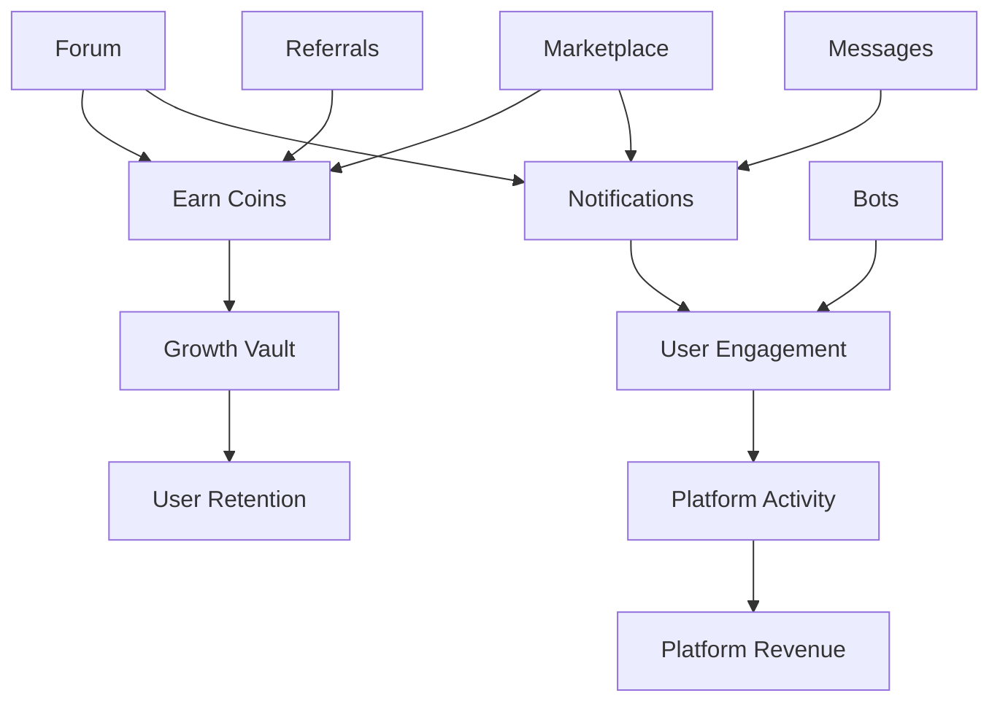

# Features Documentation

## Table of Contents
- [Overview](#overview)
- [Core Features](#core-features)
  - [1. Forum System](#1-forum-system)
  - [2. Expert Advisor Marketplace](#2-expert-advisor-marketplace)
  - [3. Sweets Economy](#3-sweets-economy)
  - [4. Messaging System](#4-messaging-system)
  - [5. Notification System](#5-notification-system)
  - [6. Bot System](#6-bot-system)
  - [7. Admin Dashboard](#7-admin-dashboard)
  - [8. User Dashboard](#8-user-dashboard)
- [Supporting Features](#supporting-features)
  - [SEO Optimization](#seo-optimization)
  - [Analytics Integration](#analytics-integration)
  - [Security Features](#security-features)
  - [Performance Features](#performance-features)
- [Feature Interactions](#feature-interactions)
- [Feature Configuration](#feature-configuration)

## Overview

YoForex is a comprehensive trading community platform that combines multiple features to create a self-sustaining ecosystem. Each feature is designed to work seamlessly with others, creating synergies that enhance user engagement and platform value.

## Core Features

### 1. Forum System

The forum is the heart of community interaction, featuring hierarchical categories, threaded discussions, and gamification elements.

#### Key Components

##### Category Hierarchy
```
Trading Strategies
├── Scalping
│   ├── EUR/USD Scalping
│   └── Gold Scalping
├── Day Trading
└── Swing Trading

Expert Advisors
├── MT4 EAs
├── MT5 EAs
└── Custom Indicators
```

##### Thread Features
- **Rich Text Editor**: TipTap-based editor with formatting options
- **Image Uploads**: Inline images and attachments
- **Code Highlighting**: Syntax highlighting for MQL4/MQL5
- **Voting System**: Upvote/downvote with karma tracking
- **Best Answer**: Mark replies as accepted solutions
- **Thread States**: Open, Locked, Pinned, Featured

##### User Interactions
```typescript
// Thread creation rewards
Create Thread → +25 coins
Thread gets 10+ replies → +10 bonus coins
Thread marked as featured → +50 coins

// Reply rewards
Post Reply → +10 coins
Reply marked as best answer → +50 coins
Reply gets 5+ likes → +5 coins
```

##### SEO Features
- Clean URLs: `/thread/best-scalping-strategy-eurusd`
- Meta descriptions auto-generated
- Structured data (Article schema)
- Sitemap integration
- Social sharing cards

##### Moderation Tools
- Report system
- Auto-moderation filters
- Moderator queue
- Bulk actions
- Ban/suspend users

#### Implementation Example

```typescript
// Creating a new thread
const createThread = async (data: ThreadData) => {
  // Validate user permissions
  if (!user.canCreateThread) {
    throw new Error('Insufficient permissions');
  }
  
  // Check rate limiting
  await checkRateLimit(user.id, 'thread_creation');
  
  // Create thread
  const thread = await db.forumThreads.create({
    title: sanitize(data.title),
    content: sanitize(data.content),
    categoryId: data.categoryId,
    userId: user.id,
    slug: generateSlug(data.title),
    tags: data.tags
  });
  
  // Award coins
  await awardCoins(user.id, 25, 'forum.thread.created');
  
  // Send notifications
  await notifyFollowers(user.id, 'new_thread', thread);
  
  // Update category stats
  await updateCategoryStats(data.categoryId);
  
  // Index for search
  await indexForSearch(thread);
  
  return thread;
};
```

### 2. Expert Advisor Marketplace

A complete e-commerce system for trading algorithms and indicators.

#### Marketplace Workflow

```
Publisher → Submit EA → Review → Approval → Listed → Purchase → Download
                ↓                     ↓                    ↓
           Requirements          Moderation          Transaction
             Check                Queue               Processing
```

#### Product Types
- **Expert Advisors (EAs)**: Automated trading robots
- **Indicators**: Technical analysis tools
- **Scripts**: One-time execution utilities
- **Templates**: Chart templates and settings
- **Strategies**: Trading strategy guides

#### Pricing Models
```javascript
// Pricing options
const pricingModels = {
  free: { price: 0, commission: 0 },
  freemium: { 
    basePrice: 0, 
    premiumFeatures: 500 // coins
  },
  oneTime: { 
    price: 1000, // coins
    commission: 0.15 // 15% platform fee
  },
  subscription: {
    monthly: 100,
    yearly: 1000,
    commission: 0.20 // 20% for subscriptions
  }
};
```

#### Product Management

##### Submission Process
1. **Upload Files**: EA files, documentation
2. **Add Details**: Description, requirements, features
3. **Set Pricing**: Choose model and price
4. **Add Media**: Screenshots, videos
5. **Submit Review**: Automated + manual checks

##### Review System
```typescript
interface ProductReview {
  rating: 1 | 2 | 3 | 4 | 5;
  title: string;
  comment: string;
  verified: boolean; // Purchased product
  helpful: number; // Upvotes
  images?: string[];
}

// Review validation
const validateReview = (review: ProductReview) => {
  // Must have purchased
  if (!review.verified) {
    throw new Error('Must purchase before reviewing');
  }
  
  // Minimum comment length
  if (review.comment.length < 50) {
    throw new Error('Review too short');
  }
  
  // Check for spam
  if (isSpam(review.comment)) {
    throw new Error('Review flagged as spam');
  }
};
```

##### Version Control
```typescript
// Product versioning
const productVersions = {
  current: '2.1.0',
  history: [
    { version: '2.0.0', date: '2024-12-01', changes: 'Major update' },
    { version: '1.5.0', date: '2024-10-15', changes: 'Bug fixes' }
  ],
  updatePolicy: 'free', // or 'paid'
};
```

#### Revenue Sharing

```typescript
// Commission calculation
const calculateCommission = (sale: Sale) => {
  const platformFee = 0.15; // 15%
  const processingFee = 0.03; // 3%
  
  const gross = sale.price;
  const platform = gross * platformFee;
  const processing = gross * processingFee;
  const net = gross - platform - processing;
  
  return {
    gross,
    platform,
    processing,
    net,
    seller: net
  };
};

// Example: 1000 coin sale
// Gross: 1000 coins
// Platform: 150 coins (15%)
// Processing: 30 coins (3%)
// Seller receives: 820 coins
```

### 3. Sweets Economy

A virtual coin system that drives engagement and monetization.

#### Earning Mechanisms

##### Forum Activities
```typescript
const forumRewards = {
  // Content creation
  createThread: 25,
  createReply: 10,
  bestAnswer: 50,
  
  // Engagement
  receiveLike: 2,
  giveLike: 1,
  dailyLogin: 5,
  
  // Milestones
  first10Threads: 100,
  first100Replies: 200,
  helpfulUser: 500 // 10+ best answers
};
```

##### Marketplace Activities
```typescript
const marketplaceRewards = {
  // Publishing
  publishEA: 100,
  firstSale: 200,
  milestone10Sales: 500,
  
  // Reviews
  writeReview: 10,
  helpfulReview: 20, // 10+ helpful votes
  
  // Purchases
  firstPurchase: 50,
  loyalCustomer: 100 // 5+ purchases
};
```

##### Referral System
```typescript
const referralRewards = {
  // Sign-ups
  referralSignup: 100,
  referralVerified: 50,
  
  // Activities
  referralFirstPost: 25,
  referralPurchase: 0.05, // 5% of purchase
  
  // Milestones
  referral5Active: 500, // 5+ active referrals
  referral10Active: 1000
};
```

#### Spending Options

##### Marketplace Purchases
- Buy EAs and indicators
- Purchase premium content
- Subscribe to services

##### Platform Features
```typescript
const premiumFeatures = {
  removeAds: 500, // coins/month
  customBadge: 1000,
  prioritySupport: 200,
  extraStorage: 300, // 10GB
  privateMessaging: 100, // unlimited
};
```

##### Withdrawals
```typescript
const withdrawalOptions = {
  paypal: {
    minimum: 1000, // coins
    fee: (tier) => {
      switch(tier) {
        case 'bronze': return 0.07; // 7%
        case 'silver': return 0.05;
        case 'gold': return 0.03;
        case 'platinum': return 0.01;
        case 'diamond': return 0; // No fee
      }
    },
    processing: '3-5 business days'
  },
  crypto: {
    minimum: 2000,
    fee: 0.02, // 2% flat
    processing: '24 hours'
  },
  giftCards: {
    minimum: 500,
    fee: 0,
    options: ['Amazon', 'Steam', 'Google Play'],
    processing: 'instant'
  }
};
```

#### Growth Vault System

The vault automatically locks 10% of earnings for 30 days to encourage retention.

```typescript
class GrowthVault {
  // Deposit earnings
  async deposit(userId: string, amount: number) {
    const vaultAmount = Math.floor(amount * 0.1); // 10%
    const walletAmount = amount - vaultAmount;
    
    // Add to wallet immediately
    await updateWallet(userId, walletAmount);
    
    // Lock in vault
    await createVaultEntry({
      userId,
      amount: vaultAmount,
      unlockDate: addDays(new Date(), 30),
      sourceTransaction: transactionId
    });
  }
  
  // Check for unlocks
  async processUnlocks() {
    const readyToUnlock = await getUnlockableVault(today());
    
    for (const entry of readyToUnlock) {
      // Transfer to wallet
      await updateWallet(entry.userId, entry.amount);
      
      // Mark as unlocked
      await markUnlocked(entry.id);
      
      // Send notification
      await notify(entry.userId, 'vault_unlocked', {
        amount: entry.amount
      });
      
      // Trigger celebration
      await triggerConfetti(entry.userId);
    }
  }
}
```

#### Loyalty Tiers

```typescript
const loyaltyTiers = {
  bronze: {
    days: 0,
    withdrawalFee: 0.07,
    perks: ['Basic support']
  },
  silver: {
    days: 22,
    withdrawalFee: 0.05,
    perks: ['Priority support', 'Silver badge']
  },
  gold: {
    days: 45,
    withdrawalFee: 0.03,
    perks: ['Gold badge', 'Early access', 'Priority support']
  },
  platinum: {
    days: 67,
    withdrawalFee: 0.01,
    perks: ['Platinum badge', 'Beta features', 'VIP support']
  },
  diamond: {
    days: 90,
    withdrawalFee: 0,
    perks: ['Diamond badge', 'All features', 'Direct support']
  }
};
```

### 4. Messaging System

Real-time private messaging with advanced features.

#### Message Types
- **Direct Messages**: 1-on-1 conversations
- **Group Chats**: Up to 50 participants
- **System Messages**: Automated notifications
- **Support Tickets**: Help desk integration

#### Features

##### Real-time Messaging
```typescript
// WebSocket events
socket.on('message:new', (message) => {
  // Add to conversation
  addMessageToUI(message);
  
  // Update unread count
  updateUnreadBadge();
  
  // Show notification
  if (!isConversationOpen(message.conversationId)) {
    showNotification(message);
  }
});

socket.on('typing:start', ({ userId, conversationId }) => {
  showTypingIndicator(userId, conversationId);
});

socket.on('message:read', ({ messageId, userId }) => {
  markAsRead(messageId, userId);
});
```

##### File Sharing
```typescript
const fileSharing = {
  maxSize: 10 * 1024 * 1024, // 10MB
  allowedTypes: [
    'image/*',
    'application/pdf',
    '.mq4', '.mq5', '.ex4', '.ex5', // Trading files
    '.zip', '.rar'
  ],
  virusScan: true,
  encryption: true
};
```

##### Message Features
- Read receipts
- Typing indicators
- Message reactions (emojis)
- Reply to specific message
- Forward messages
- Delete messages
- Edit messages (5 minute window)
- Pin important messages

##### Privacy Controls
```typescript
const privacySettings = {
  whoCanMessage: 'everyone' | 'following' | 'nobody',
  blockList: string[], // User IDs
  readReceipts: boolean,
  onlineStatus: boolean,
  typingIndicators: boolean,
  messageRequests: boolean // Approve before chat
};
```

### 5. Notification System

Multi-channel notification delivery system.

#### Notification Channels

##### In-App Notifications
```typescript
const inAppNotification = {
  id: 'notif_123',
  type: 'thread_reply',
  title: 'New reply to your thread',
  message: 'John replied to "Best EA Settings"',
  icon: 'message-circle',
  actionUrl: '/thread/best-ea-settings#reply-456',
  read: false,
  createdAt: new Date()
};
```

##### Email Notifications
```typescript
const emailTemplates = {
  welcome: {
    subject: 'Welcome to YoForex!',
    template: 'welcome.html',
    variables: ['username', 'verificationLink']
  },
  threadReply: {
    subject: 'New reply to: {{threadTitle}}',
    template: 'thread-reply.html',
    variables: ['threadTitle', 'replyAuthor', 'replyContent']
  },
  purchase: {
    subject: 'Purchase confirmation: {{productName}}',
    template: 'purchase.html',
    variables: ['productName', 'price', 'downloadLink']
  },
  withdrawal: {
    subject: 'Withdrawal processed',
    template: 'withdrawal.html',
    variables: ['amount', 'method', 'status']
  }
};
```

##### Push Notifications (Mobile)
```typescript
const pushNotification = {
  title: 'New message',
  body: 'Sarah sent you a message',
  icon: '/icon-192x192.png',
  badge: '/badge-72x72.png',
  vibrate: [100, 50, 100],
  data: {
    conversationId: 'conv_123',
    messageId: 'msg_456'
  },
  actions: [
    { action: 'reply', title: 'Reply' },
    { action: 'dismiss', title: 'Dismiss' }
  ]
};
```

#### Notification Types

```typescript
enum NotificationType {
  // Forum
  THREAD_REPLY = 'thread_reply',
  THREAD_LIKE = 'thread_like',
  BEST_ANSWER = 'best_answer',
  THREAD_MENTION = 'thread_mention',
  
  // Marketplace
  PRODUCT_SOLD = 'product_sold',
  PRODUCT_REVIEWED = 'product_reviewed',
  PRODUCT_UPDATED = 'product_updated',
  
  // Social
  NEW_FOLLOWER = 'new_follower',
  PROFILE_VIEW = 'profile_view',
  
  // Coins
  COINS_EARNED = 'coins_earned',
  VAULT_UNLOCKED = 'vault_unlocked',
  WITHDRAWAL_PROCESSED = 'withdrawal_processed',
  
  // System
  SYSTEM_ANNOUNCEMENT = 'system_announcement',
  MAINTENANCE = 'maintenance',
  SECURITY_ALERT = 'security_alert'
}
```

#### Notification Preferences

```typescript
const userPreferences = {
  email: {
    threadReplies: true,
    productSales: true,
    weeklyDigest: true,
    marketing: false
  },
  push: {
    messages: true,
    coinAlerts: true,
    systemAlerts: true
  },
  inApp: {
    all: true // Can't disable in-app
  },
  quietHours: {
    enabled: true,
    start: '22:00',
    end: '08:00',
    timezone: 'America/New_York'
  }
};
```

### 6. Bot System

Automated engagement and content generation system.

#### Bot Types

##### Engagement Bots
```typescript
class EngagementBot {
  async run() {
    // Welcome new users
    const newUsers = await getNewUsers();
    for (const user of newUsers) {
      await sendWelcomeMessage(user);
      await suggestPopularThreads(user);
    }
    
    // Revive dead threads
    const inactiveThreads = await getInactiveThreads(7); // 7 days
    for (const thread of inactiveThreads) {
      if (shouldRevive(thread)) {
        await postRevivalReply(thread);
      }
    }
    
    // Like quality content
    const goodContent = await findQualityContent();
    for (const content of goodContent) {
      await likeContent(content);
    }
  }
}
```

##### Content Bots
```typescript
class ContentBot {
  async generateDailyTips() {
    const tips = [
      'Market analysis for today',
      'EA optimization tips',
      'Risk management strategies'
    ];
    
    for (const tip of tips) {
      const content = await generateContent(tip);
      await postThread({
        title: content.title,
        content: content.body,
        categoryId: 'daily-tips',
        authorId: 'bot_daily_tips'
      });
    }
  }
}
```

##### Moderation Bots
```typescript
class ModerationBot {
  async scan() {
    // Check for spam
    const newContent = await getUnscannedContent();
    for (const content of newContent) {
      const spamScore = await checkSpam(content);
      if (spamScore > 0.8) {
        await flagForReview(content, 'spam');
      }
    }
    
    // Check for inappropriate content
    const flagged = await checkInappropriate(newContent);
    for (const item of flagged) {
      await quarantine(item);
      await notifyModerators(item);
    }
  }
}
```

#### Bot Configuration

```typescript
const botConfig = {
  maxActionsPerHour: 100,
  cooldownBetweenActions: 30, // seconds
  activeHours: {
    start: 8,
    end: 22
  },
  behavior: {
    replyProbability: 0.3,
    likeProbability: 0.5,
    followProbability: 0.2
  },
  personality: {
    tone: 'helpful',
    expertise: ['scalping', 'risk-management'],
    responseLength: 'medium'
  }
};
```

### 7. Admin Dashboard

Comprehensive administration and moderation tools.

#### Dashboard Sections

##### Overview
```typescript
const overviewMetrics = {
  users: {
    total: 10234,
    active: 3456, // Last 7 days
    new: 234, // Today
    growth: '+12%' // Month over month
  },
  revenue: {
    total: 50000, // coins
    month: 5000,
    pending: 1234,
    chart: [] // 30-day trend
  },
  content: {
    threads: 12345,
    replies: 56789,
    products: 567,
    pendingModeration: 23
  },
  system: {
    uptime: '99.9%',
    responseTime: '145ms',
    errorRate: '0.02%',
    queueSize: 12
  }
};
```

##### User Management
- Search and filter users
- View user profiles and activity
- Edit user permissions
- Ban/suspend accounts
- Merge duplicate accounts
- Export user data
- Send mass emails

##### Content Moderation
```typescript
const moderationQueue = {
  reported: [], // User reports
  automated: [], // Bot flagged
  appeals: [], // Ban appeals
  
  actions: {
    approve: () => {},
    reject: (reason) => {},
    edit: (changes) => {},
    delete: () => {},
    ban: (duration) => {}
  },
  
  bulkActions: {
    approveAll: () => {},
    rejectAll: (reason) => {},
    assignTo: (moderatorId) => {}
  }
};
```

##### Financial Management
- View transactions
- Process withdrawals
- Handle refunds
- Generate reports
- Tax documentation
- Revenue analytics

##### Bot Management
- Configure bot behavior
- View bot activity logs
- Adjust bot parameters
- Enable/disable bots
- Bot performance metrics

##### System Configuration
```typescript
const systemConfig = {
  features: {
    enableRegistration: true,
    enableMarketplace: true,
    enableBots: true,
    maintenanceMode: false
  },
  limits: {
    maxThreadsPerDay: 10,
    maxMessagesPerMinute: 30,
    maxFileSize: 10485760, // 10MB
    maxWithdrawal: 10000 // coins
  },
  fees: {
    marketplaceCommission: 0.15,
    withdrawalFee: 0.03,
    minimumWithdrawal: 1000
  }
};
```

### 8. User Dashboard

Personalized dashboard with retention features.

#### Dashboard Widgets

##### Earnings Counter
```typescript
const earningsWidget = {
  current: 5432, // Current balance
  earned: {
    today: 125,
    week: 890,
    month: 3456
  },
  sparkline: [120, 135, 128, 145, 160, 155, 170], // 7 days
  nextMilestone: {
    target: 6000,
    reward: 'Gold Badge',
    progress: 0.91 // 91%
  }
};
```

##### Growth Vault
```typescript
const vaultWidget = {
  locked: 543, // Locked coins
  unlocking: {
    tomorrow: 50,
    thisWeek: 125,
    thisMonth: 400
  },
  history: [
    { date: '2025-01-05', amount: 75, status: 'unlocked' },
    { date: '2025-01-10', amount: 50, status: 'pending' }
  ],
  totalUnlocked: 2345
};
```

##### Activity Heatmap
```typescript
const activityHeatmap = {
  data: [
    { hour: 0, day: 'Mon', value: 5 },
    { hour: 1, day: 'Mon', value: 3 },
    // ... 168 data points (24 hours × 7 days)
  ],
  stats: {
    mostActiveHour: 14, // 2 PM
    mostActiveDay: 'Wed',
    currentStreak: 7,
    longestStreak: 21
  }
};
```

##### Badge Wall
```typescript
const badges = [
  {
    id: 'early_bird',
    name: 'Early Bird',
    description: 'Joined in first month',
    icon: '🌅',
    earned: true,
    date: '2024-01-15'
  },
  {
    id: 'helpful_member',
    name: 'Helpful Member',
    description: '10+ best answers',
    icon: '🎯',
    earned: false,
    progress: 0.7 // 7/10
  }
];
```

## Supporting Features

### SEO Optimization

#### Technical SEO
```typescript
const seoFeatures = {
  // URL structure
  urls: {
    pattern: '/category/subcategory/thread-slug',
    canonical: true,
    trailing_slash: false
  },
  
  // Meta tags
  meta: {
    title: '{{title}} | YoForex',
    description: 'Auto-generated from content',
    keywords: 'Extracted from tags',
    og_image: 'Dynamic generation'
  },
  
  // Performance
  performance: {
    lazy_loading: true,
    image_optimization: true,
    minification: true,
    caching: true
  },
  
  // Structured data
  schema: {
    types: ['Article', 'Product', 'BreadcrumbList'],
    automatic: true
  }
};
```

### Analytics Integration

#### Tracking Events
```typescript
const analytics = {
  // Page views
  pageView: (page) => {
    gtag('event', 'page_view', { page_path: page });
  },
  
  // User events
  userEvent: (action, category, label, value) => {
    gtag('event', action, {
      event_category: category,
      event_label: label,
      value: value
    });
  },
  
  // E-commerce
  purchase: (item, value) => {
    gtag('event', 'purchase', {
      transaction_id: item.id,
      value: value,
      currency: 'USD',
      items: [item]
    });
  },
  
  // Custom events
  custom: (name, parameters) => {
    gtag('event', name, parameters);
  }
};
```

### Security Features

#### Protection Mechanisms
```typescript
const security = {
  // Authentication
  auth: {
    bcrypt_rounds: 12,
    session_duration: 30 * 24 * 60 * 60, // 30 days
    jwt_secret: process.env.JWT_SECRET,
    csrf_protection: true
  },
  
  // Rate limiting
  rateLimits: {
    api: '100/minute',
    auth: '5/minute',
    upload: '10/hour'
  },
  
  // Input validation
  validation: {
    sanitize_html: true,
    sql_injection: 'parameterized queries',
    xss_protection: 'CSP headers'
  },
  
  // Data protection
  encryption: {
    passwords: 'bcrypt',
    sensitive_data: 'AES-256',
    communications: 'TLS 1.3'
  }
};
```

### Performance Features

#### Optimization Strategies
```typescript
const performance = {
  // Caching
  caching: {
    cdn: 'Cloudflare',
    browser: '1 year for assets',
    api: 'Redis for frequent queries',
    database: 'Query result cache'
  },
  
  // Loading
  loading: {
    code_splitting: true,
    lazy_loading: true,
    progressive_images: true,
    service_worker: true
  },
  
  // Database
  database: {
    connection_pooling: 20,
    indexed_queries: true,
    query_optimization: true,
    read_replicas: false // Future
  },
  
  // Monitoring
  monitoring: {
    uptime: 'Pingdom',
    errors: 'Sentry',
    analytics: 'Google Analytics',
    performance: 'Web Vitals'
  }
};
```

## Feature Interactions

### Cross-Feature Synergies



### Feature Dependencies

| Feature | Depends On | Enables |
|---------|-----------|---------|
| Forum | Users, Auth | Coins, Notifications |
| Marketplace | Users, Coins | Revenue, Notifications |
| Messaging | Users, Auth | Engagement, Support |
| Coins | Transactions | Marketplace, Withdrawals |
| Vault | Coins | Retention, Gamification |
| Bots | Admin, Coins | Engagement, Content |
| Notifications | All features | Engagement, Retention |

## Feature Configuration

### Environment Variables

```env
# Feature flags
ENABLE_FORUM=true
ENABLE_MARKETPLACE=true
ENABLE_MESSAGING=true
ENABLE_BOTS=true
ENABLE_NOTIFICATIONS=true
ENABLE_WITHDRAWALS=true

# Feature limits
MAX_THREAD_LENGTH=10000
MAX_REPLY_LENGTH=5000
MAX_MESSAGE_LENGTH=1000
MAX_FILE_SIZE=10485760
MAX_WITHDRAWAL=10000

# Feature settings
FORUM_CATEGORIES=60
MARKETPLACE_COMMISSION=0.15
VAULT_PERCENTAGE=0.10
BOT_COUNT=10
NOTIFICATION_BATCH_SIZE=100
```

### Feature Permissions

```typescript
const featurePermissions = {
  forum: {
    view: ['guest', 'user', 'moderator', 'admin'],
    create: ['user', 'moderator', 'admin'],
    moderate: ['moderator', 'admin'],
    delete: ['admin']
  },
  marketplace: {
    view: ['guest', 'user', 'moderator', 'admin'],
    purchase: ['user', 'moderator', 'admin'],
    publish: ['user', 'moderator', 'admin'],
    moderate: ['moderator', 'admin']
  },
  messaging: {
    send: ['user', 'moderator', 'admin'],
    broadcast: ['admin']
  },
  admin: {
    access: ['admin'],
    financial: ['admin'],
    system: ['admin']
  }
};
```

## Summary

YoForex's features are designed to work together as an integrated ecosystem:

1. **Forum** drives community engagement
2. **Marketplace** enables monetization
3. **Sweets Economy** incentivizes participation
4. **Messaging** facilitates connections
5. **Notifications** maintain engagement
6. **Bots** automate operations
7. **Admin Tools** ensure quality
8. **User Dashboard** visualizes progress

Each feature enhances the others, creating a platform that grows stronger with scale and provides value to all stakeholders.